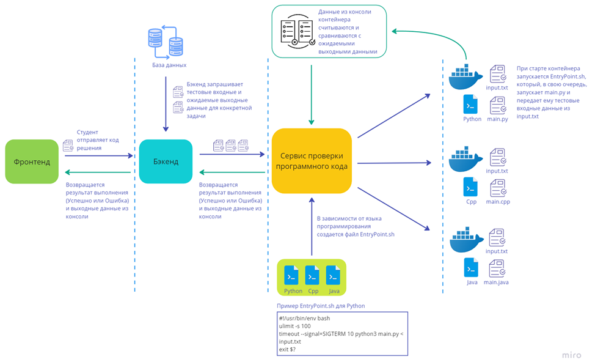

# Образовательная платформа для интерактивного изучения языков программирования

## Описание проекта

Разработка бэкенда веб-приложения, объединяющего лекционный материал, практические задания и инструменты самопроверки, включая компилятор.  
Проект создан для автоматизации учебного процесса студентов, изучающих программирование.

Бэкенд и компилятор размещены на отдельных серверах и взаимодействуют через HTTP-сообщения. На стадии разработки база данных PostgreSQL, бэкенд и компилятор запускались на разных портах одного локального сервера.

## Использованные технологии

- **СУБД**: PostgreSQL
- **API**: JDBC
- **Фреймворки**: Spring (Spring Boot, Spring Security), Hibernate (Spring Data JPA)
- **Сборщик проекта**: Apache Maven
- **Токены**: JSON Web Token (JWT)
- **Прочее ПО**: IntelliJ IDEA, Docker, Postman

## Функционал

### Роли пользователей

- **Администратор**: просмотр и управление учетными данными пользователей, регистрация новых преподавателей, просмотр информации обо всех курсах.
- **Преподаватель**: создание, редактирование, удаление курсов, лекций, задач и квизов, анализ успеваемости студентов.
- **Студент**: регистрация, запись на курсы, изучение лекций и выполнение заданий (ответы на вопросы и решение задач), тестирование программного кода.

### Работа с заданиями

Набор тестовых входных данных для проверки решения задачи подготавливает преподаватель.
Они хранятся в БД вместе с условием задачи и ожидаемыми выходными данными.

Студенты могут тестировать решения на Java, C++ или Python через встроенный компилятор, запущенный в Docker.

### Структура базы данных

#### ER-диаграмма (Нотация Чена)

#### ER-диаграмма (Нотация Мартина)

## Endpoints

### Общедоступные запросы
- **POST** `/api/v1/auth/authenticate`: Аутентификация
- **POST** `/api/v1/auth/register`: Регистрация
- **GET** `/api/v1/courses`: Список курсов
- **GET** `/api/v1/courses/{courseId}/lectures`: Лекции курса
- **GET** `/api/v1/courses/{courseId}/lectures/{lectureId}`: Просмотр лекции
- **GET** `/api/v1/lectures/{lectureId}/quizzes`: Список квизов лекции

### Запросы администратора
- **POST** `/api/v1/teacher`: Регистрация преподавателя
- **GET** `/api/v1/teachers`: Список преподавателей

### Запросы преподавателя
- **POST** `/api/v1/course`: Создание курса
- **PUT** `/api/v1/courses/{courseId}`: Редактирование курса
- **DELETE** `/api/v1/courses/{courseId}`: Удаление курса
- **POST** `/api/v1/courses/{courseId}/lecture`: Создание лекции
- **PUT** `/api/v1/courses/{courseId}/lectures/{lectureId}`: Редактирование лекции
- **DELETE** `/api/v1/courses/{courseId}/lectures/{lectureId}`: Удаление лекции
- **POST** `/api/v1/lectures/{lectureId}/quiz`: Создание квиза
- **PUT** `/api/v1/lectures/{lectureId}/quizzes/{quizId}`: Редактирование квиза
- **DELETE** `/api/v1/lectures/{lectureId}/quizzes/{quizId}`: Удаление квиза
- **POST** `/api/v1/lectures/{lectureId}/task`: Создание задачи
- **PUT** `/api/v1/lectures/{lectureId}/task`: Редактирование задачи
- **DELETE** `/api/v1/lectures/{lectureId}/task`: Удаление задачи

### Запросы студента
- **POST** `/api/v1/enroll/{courseId}`: Запись на курс
- **POST** `/api/v1/lectures/{lectureId}/compiler`: Тестирование программы

## Алгоритм работы компилятора

