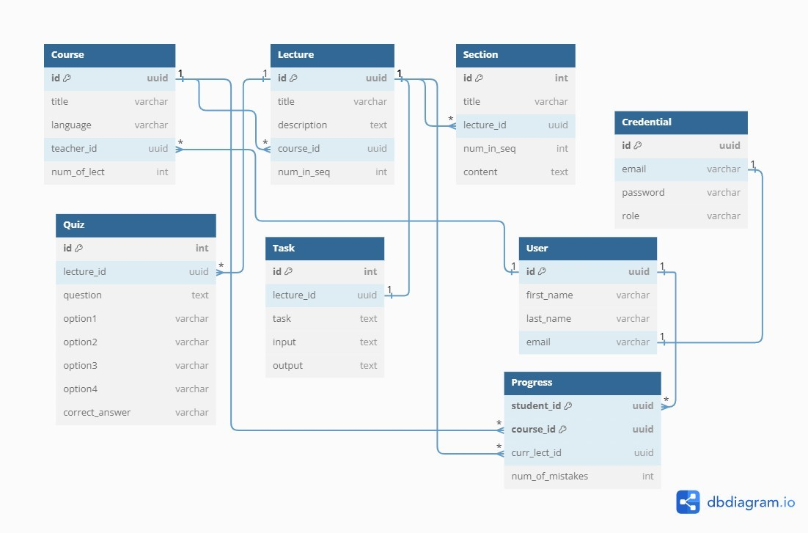
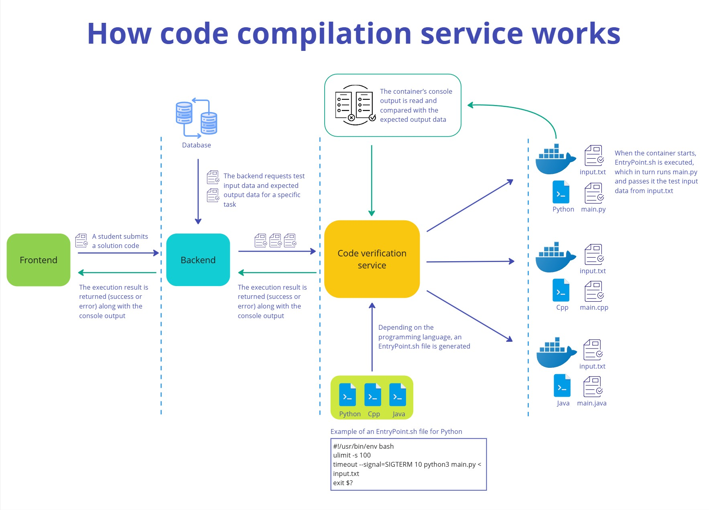

# CodeLine – educational platform for interactive learning of programming languages
Project description is also available in Russian: [Russian version](README.ru.md).

## Concept
This project is a learning pet project that implements a web application combining lecture materials, practical tasks, and self-check tools, including an integrated compilation service. The goal is to automate and optimize the learning process for students studying programming.

## Teck stack
This pet project implements only the backend and compiler service.
+ **Programming languages:** Java 21, SQL.
+ **Frameworks and libraries:** Spring (Boot, Data, Security), Hibernate.
+ **Security and authentication:** JSON Web Token (JWT), OAuth 2.0.
+ **Build and dependency management:** Apache Maven.
+ **Database management systems:** PostgreSQL.
+ **Containerization:** Docker.
+ **APIs and web services:** REST, HTTP, Swagger, Postman.
+ **Version control and collaboration:** Git, GitHub.

The application was developed using IntelliJ IDEA Community Edition.

## Functionality
### Business Logic
Teachers are course authors in the platform catalog. Courses consist of lectures. All lectures are numbered and titled to maintain chronological order. Students can take multiple courses simultaneously. Each lecture consists of sections, which are also numbered and titled.

After reading a lecture, a student must complete a random set of thematic quizzes, each with 4 answer options. If a student answers incorrectly, a new set of questions is generated. Each incorrect answer adds a penalty point.
**A lecture is considered passed only if all quizzes in the set are answered correctly.** Until then, the student cannot open the next lecture.

In addition to quizzes, each lecture has a practical task. Students must write, compile, and test a small program in Java, C++, or Python. Teachers prepare multiple test input sets for each task. Test cases, task description, and expected outputs are stored in the database. Students can test their solutions via the built-in compiler service, which runs in Docker.

### User roles and permissions
Users can have one of three roles: administrator, teacher, or student.

**Administrator** can:
+ view and manage credentials for all users;
+ register new teachers in the system;
+ view any course or lecture with all sections, quizzes, and tasks;
+ collect and analyze platform usage statistics.

**Teacher** can:
+ create, view, edit, and delete courses, lectures, sections, tasks, and quizzes;
+ monitor and analyze student performance.

_**Only the course author** can modify the course structure or content!_

**Student** can:
+ register themselves;
+ enroll in any course in the catalog;
+ view lectures and complete tasks (answer quizzes and solve programming problems);
+ test their code via the compiler.

### Registration and authentication
Authentication and authorization are the same for all users.

Registration differs by role:
+ _Students_ register themselves.
+ _Teachers_ are added by administrator. When admin registers a new teacher, the system automatically generates a password and sends it to the teacher’s email. The teacher’s username for signing in is the email address where they received the password.
+ _Administrator_ does not need to register.

## Database description
The app uses a relational database model. The logical model of the database is shown below using Martin’s ER notation.



The database contains 8 tables:
+ **User:** stores general information about all usersz;
+ **Credential:** stores authentication and authorization data;
+ **Course:** course information;
+ **Lecture:** lecture information;
+ **Section:** sections of lectures;
+ **Quiz:** quizzes associated with lectures;
+ **Task:** programming tasks associated with lectures;
+ **Progress:** student progress across enrolled courses.

## Endpoints
### Public
- **POST** `/api/v1/auth/authenticate` – Authenticate
- **POST** `/api/v1/auth/register` – Register
- **GET** `/api/v1/courses` – List courses
- **GET** `/api/v1/courses/{courseId}/lectures` – Lectures in a course
- **GET** `/api/v1/courses/{courseId}/lectures/{lectureId}` – View lecture
- **GET** `/api/v1/lectures/{lectureId}/quizzes` – List quizzes for a lecture

### For admin
- **POST** `/api/v1/teacher` – Register teacher
- **GET** `/api/v1/teachers` – List teachers

### For teachers
- **POST** `/api/v1/course` – Create course
- **PUT** `/api/v1/courses/{courseId}` – Edit course
- **DELETE** `/api/v1/courses/{courseId}` – Delete course
- **POST** `/api/v1/courses/{courseId}/lecture` – Create lecture
- **PUT** `/api/v1/courses/{courseId}/lectures/{lectureId}` – Edit lecture
- **DELETE** `/api/v1/courses/{courseId}/lectures/{lectureId}` – Delete lecture
- **POST** `/api/v1/lectures/{lectureId}/quiz` – Create quiz
- **PUT** `/api/v1/lectures/{lectureId}/quizzes/{quizId}` – Edit quiz
- **DELETE** `/api/v1/lectures/{lectureId}/quizzes/{quizId}` – Delete quiz
- **POST** `/api/v1/lectures/{lectureId}/task` – Create task
- **PUT** `/api/v1/lectures/{lectureId}/task` – Edit task
- **DELETE** `/api/v1/lectures/{lectureId}/task` – Delete task

### For students
- **POST** `/api/v1/enroll/{courseId}` – Enroll in course
- **POST** `/api/v1/lectures/{lectureId}/compiler` – Test code

## Compiler
The generalized workflow of the compilation service is shown below:



## Application deployment
The backend and compiler are intended to run on separate servers communicating via HTTP. During development, PostgreSQL, backend, and compiler were running simultaneously on different ports on a single local server.

### 1. Clone the repository
```
git clone https://github.com/NadezhdaLikh/CodeLine.git
cd CodeLine
```

### 2. Setup your database
1. Install and start PostgreSQL.
2. Create a database.
3. Copy `backend/application.yml.example` → `backend/application.yml` and add the database credentials.

### 3. Add admin's credentials

**Before** the first run, open `backend/src/main/java/ru/codeline/configuration/AdminCredentials.java` and set the admin's name, email, and password. The admin user will be automatically created in the database on the first run.

### 4. Run the application
First **backend:**
```
cd backend
./mvnw spring-boot:run
```

+ Port: 8080
+ Connects to PostgreSQL and interacts with the compiler service

Then **compiler:**
```
cd compiler
./mvnw spring-boot:run
```

+ Port: 5000
+ Docker must be installed and running!
