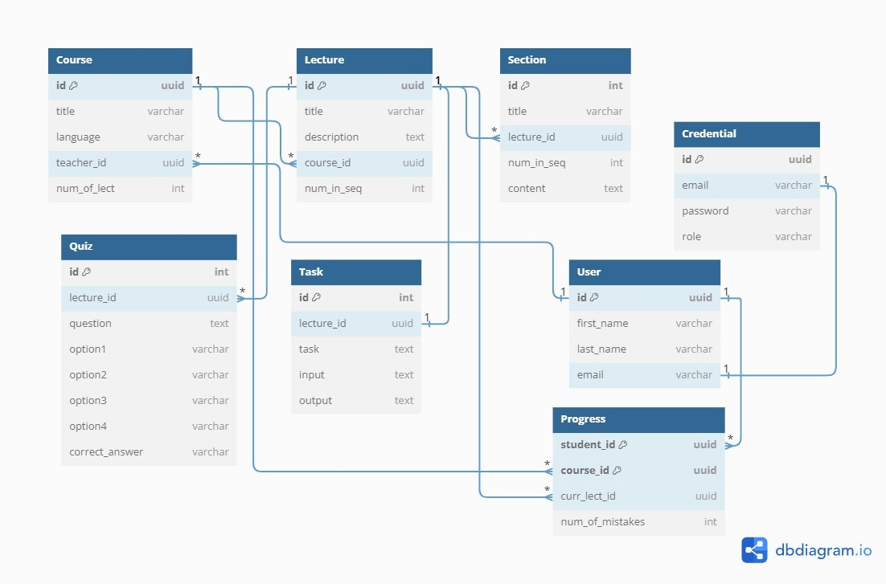

# CodeLine - образовательная платформа для интерактивного изучения языков программирования
Описание проекта доступно также на английском языке: [English version](README.md).
## Концепция
Данный проект является учебным pet-проектом и реализует функционал веб-приложения, объединяющего лекционный материал, практические задания и инструменты самопроверки, включая интегрированный сервис компиляции. Цель проекта - автоматизация и оптимизация учебного процесса студентов, изучающих программирование.

## Технологический стек
В рамках данного pet-проекта реализована только серверная часть (backend) приложения и сервис компиляции.
+ **Языки программирования:** Java 21, SQL.
+ **Фреймворки и библиотеки:** Spring (Boot, Data, Security), Hibernate.
+ **Безопасность и аутентификация:** JSON Web Token, OAuth 2.0.
+ **Управление сборкой и зависимостями:** Apache Maven.
+ **Системы управления базами данных (СУБД):** PostgreSQL.
+ **Технологии контейнеризации:** Docker.
+ **API и веб-сервисы:** REST, HTTP, Swagger, Postman.
+ **Контроль версий и совместная работа:** Git, GitHub.

Веб-приложение разрабатывалось в IDE IntelliJ IDEA Community Edition.

## Функционал
### Бизнес-логика
Преподаватели являются авторами курсов в каталоге платформы. Курсы состоят из лекций. Все лекции в курсе озаглавнены и пронумерованы для соблюдения хронолгического порядка, когда студент изучает курс. Учащийся может одновременно проходить несколько курсов.

Каждая лекция в курсе – это совокупность некоторого числа разделов. Все разделы также нумеруются и озаглавливаются. 

После прочтения лекции учащийся должен решить случайный набор тематических квизов, то есть ответить на несколько вопросов, где предложены 4 варианта ответа. Если студент ошибается в одном из квизов, формируется новый набор, с уже другими вопросами. За каждый неправильный ответ начисляется штрафной балл. **Лекция считается успешно пройденной, только если студент одновременно решил все квизы из набора правильно**. До тех пор студент не сможет открыть следующую лекцию.

Кроме квизов, в курсах есть практические задачи, по одной на лекцию. Студенту предлагается написать, скомпилировать и протестировать небольшую программу на одном из трех языков программирования: Java, C++ или Python. Для проверки решения задачи преподаватель подготавливает несколько наборов тестовых входных данных. Они хранятся в базе данных приложения вместе с условием задачи и ожидаемыми выходными данными. Студенты могут тестировать решения через встроенный компилятор, запущенный в Docker.

### Роли и полномочия пользователей
Пользователю приложения может быть назначена одна из трех ролей: администратор, преподаватель или студент. 

**Администратор** может: 
+ просматривать учетные данные всех пользователей и управлять ими;
+ регистрировать в системе новых преподавателей;
+ просмотривать любые курсы и лекции со всеми разделами, квизами и задачами;
+ собирать и анализировать статистику о работе платформы.

**Преподаватель** может: 
+ просматривать, создавать, редактировать и удалять курсы, лекции, разделы, задачи и квизы.
+ осуществлять мониторинг и анализ успеваемости студентов.

_Вносить изменения в структуру и содержимое курса может **только автор курса**!_
  
**Студент** может: 
+ самостоятельно зарегистрироваться в системе;
+ записаться на любой курс, представленный в каталоге, выбрать понравившихся автора, тему и язык программирования;
+ просматривать лекции и выполнять задания: отвечать на вопросы и решать задачи;
+ тестировать свой код.

### Регистрация и авторизация
Процедура аутентификации и авторизации одинаковая для всех пользователей.

Регистрация осуществляться по-разному: 
+ _Студенты_ регистрируются сами.
+ _Преподаватели_ добавляются администратором. При регистрации нового преподавателя системой автоматически генерируется пароль, который отправляется на его email. Логином преподавателя для входа в систему является email-адрес, на который было отправлено письмо с паролем.
+ _Администратору_ регистрироваться в системе не требуется.

## Описание базы данных
Для данного приложения использовалась реляционная модель базы данных. Инфологическая и даталогическая модели БД представлены в виде ER-диаграмм в нотации Чена и Мартина соотвественно на рисунках ниже.

### ER-диаграмма в нотации Чена)


### ER-диаграмма в нотации Мартина



В базе данных приложения есть 8 таблиц:
+ в **“User”** хранится общая информация обо всех пользователях веб-приложения;
+ в **“Credential”** содержатся данные, отвечающие за идентификацию, аутентификацию и авторизацию каждого пользователя;
+ в **“Course”** хранится информация о курсах, представленных в каталоге;
+ в **“Lecture”** хранятся сведения о лекциях в курсах;
+ в **“Section”** хранится информация о разделах каждой лекции;
+ в **“Quiz”** хранится информация о квизах к лекциям;
+ в **“Task”** содержатся условия задач к лекциям;
+ **“Progress”** демонстрирует успеваемость каждого студента на всех курсах, на которые он записался. 

## Эндпоинты

### Общедоступные запросы
- **POST** `/api/v1/auth/authenticate`: Аутентификация
- **POST** `/api/v1/auth/register`: Регистрация
- **GET** `/api/v1/courses`: Список курсов
- **GET** `/api/v1/courses/{courseId}/lectures`: Лекции курса
- **GET** `/api/v1/courses/{courseId}/lectures/{lectureId}`: Просмотр лекции
- **GET** `/api/v1/lectures/{lectureId}/quizzes`: Список квизов лекции

### Запросы администратора
- **POST** `/api/v1/teacher`: Регистрация преподавателя
- **GET** `/api/v1/teachers`: Список преподавателей

### Запросы преподавателя
- **POST** `/api/v1/course`: Создание курса
- **PUT** `/api/v1/courses/{courseId}`: Редактирование курса
- **DELETE** `/api/v1/courses/{courseId}`: Удаление курса
- **POST** `/api/v1/courses/{courseId}/lecture`: Создание лекции
- **PUT** `/api/v1/courses/{courseId}/lectures/{lectureId}`: Редактирование лекции
- **DELETE** `/api/v1/courses/{courseId}/lectures/{lectureId}`: Удаление лекции
- **POST** `/api/v1/lectures/{lectureId}/quiz`: Создание квиза
- **PUT** `/api/v1/lectures/{lectureId}/quizzes/{quizId}`: Редактирование квиза
- **DELETE** `/api/v1/lectures/{lectureId}/quizzes/{quizId}`: Удаление квиза
- **POST** `/api/v1/lectures/{lectureId}/task`: Создание задачи
- **PUT** `/api/v1/lectures/{lectureId}/task`: Редактирование задачи
- **DELETE** `/api/v1/lectures/{lectureId}/task`: Удаление задачи

### Запросы студента
- **POST** `/api/v1/enroll/{courseId}`: Запись на курс
- **POST** `/api/v1/lectures/{lectureId}/compiler`: Тестирование программы

## Компилятор
Обобщенный алгоритм работы сервиса компиляции изображен на рисунке ниже.


## Развертывание приложения
Подразумевается, что веб-приложение и компилятор размещены на отдельных серверах и взаимодействуют между собой посредством обмена HTTP-сообщениями, однако на стадии разработки база данных PostgreSQL, бэкенд и компилятор запускались **одновременно** на разных портах одного локального сервера.

### Клонирование репозитория
```
git clone https://github.com/NadezhdaLikh/CodeLine.git
cd CodeLine
```

### Настройка базы данных
1. Установите и запустите PostgreSQL.
2. Создайте базу данных.
3. Скопируйте `application.yml.example` из папки backend в `application.yml` и добавьте учетные данные, необходимые для установки соединения с БД.

### Добавление учетных данных администратора
**Перед** первым запуском откройте `backend/src/main/java/ru/codeline/configuration/AdminCredentials.java` и задайте имя, фамилию, email и пароль администратора приложения. При первом запуске бэкенда запись о нем будет автоматически добавлена в базу данных.

### Запуск приложения
**Бэкенд:**

```
cd backend
./mvnw spring-boot:run
```

+ Порт: 8080.
+ Подключается к базе данных PostgreSQL и взаимодействует с сервисом компиляции.

**Компилятор:**

```
cd compiler
./mvnw spring-boot:run
```

+ Порт: 5000.
+ Требуется установленный и запущенный Docker!
